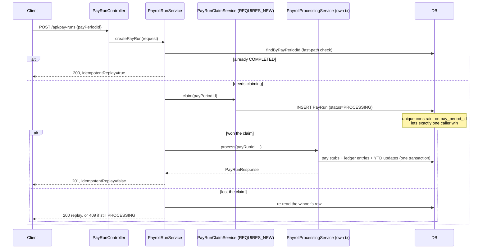

# Payroll Processing Engine

A backend system that computes and posts payroll the way a real payroll or
banking-adjacent system has to: **idempotent** (retrying a request never
double-pays anyone), **atomic** (a failure partway through leaves zero
side effects, not a half-paid company), and **auditable** (every dollar
moved is backed by a balanced double-entry ledger). Built in Java 17 /
Spring Boot 3 as a portfolio project targeting backend/SWE roles at
companies where "the money math has to be exactly right" is the job
(Fidelity, JPMorgan Chase, Paycom).

## Why this project

Fidelity and JPMorgan run large-scale ledgers and transaction/settlement
systems; Paycom runs the same category of system for payroll specifically.
All three have the same non-negotiable property: a request that gets
retried, duplicated by a flaky client, or raced by two concurrent workers
must never move money twice. That property — not the payroll domain
itself — is the actual point of this project. The payroll domain just
gives it something concrete and checkable to compute.

## What it does

- **Employees** — salaried or hourly, with filing status and pay frequency.
- **Pay periods & pay runs** — trigger payroll for a period; it computes
  gross pay (including time-and-a-half overtime for hourly employees),
  federal income tax withholding, and FICA (Social Security + Medicare,
  including the Social Security wage base cap and the Additional Medicare
  Tax threshold) for every active employee, using **BigDecimal** throughout
  — money is never represented as a `double`.
- **Idempotent pay runs** — POST the same `payPeriodId` twice and the
  second call returns the *same* result (`idempotentReplay: true`, HTTP
  200) instead of processing payroll again. See [Idempotency & concurrency
  design](#idempotency--concurrency-design) below for how.
- **A client-supplied `Idempotency-Key` header** (Stripe-style), honored on
  *any* POST endpoint — not just pay runs. Retry a request with the same
  key and identical body and you get back the exact original response; the
  same key with a different body is rejected (`422`) as a client bug, not
  silently accepted. See [The `Idempotency-Key`
  header](#the-idempotency-key-header) below.
- **A balanced double-entry ledger** — every pay run posts real
  debit/credit entries (Payroll Expense, Employer Payroll Tax Expense,
  Federal Withholding Payable, FICA Payable, Cash), and `GET
  /api/ledger/verify` checks that total debits equal total credits across
  the entire system. If that ever returns `false`, it means a calculation
  bug, not a bookkeeping error.
- **A concurrency test that actually races two threads** against the same
  pay period and asserts exactly one of them wins — not just "call the
  method twice in sequence."

## Idempotency & concurrency design



Three things make this correct under real concurrency, not just in the
happy path:

1. **The unique constraint is the actual guarantee, not the code.**
   `pay_runs.pay_period_id` is unique (V1 migration). Two concurrent
   requests both try to `INSERT`; the database — not application logic —
   guarantees only one succeeds. Everything else in the design exists to
   react correctly to that outcome.

2. **The claim lives in its own transaction (`REQUIRES_NEW`), deliberately.**
   After a JPA/Hibernate flush fails on a constraint violation, that
   persistence context can't be trusted for further work in the same
   transaction — so the loser must roll back a *small* transaction, not
   poison a large one. See `PayRunClaimService` and the comment on why it
   explicitly calls `setRollbackOnly()`.

3. **A failure after a successful claim needs a compensating write, not just
   a rollback.** The claim commits independently (`REQUIRES_NEW`) before
   the actual payroll processing runs. If processing then fails, the
   `PayRun` row is already durably `PROCESSING` and would otherwise be
   stuck forever, permanently blocking that pay period (because the unique
   constraint now prevents any future claim). `PayrollRunService` catches
   that failure and calls `PayRunClaimService.markFailed`, which flips the
   row to `FAILED` so a future request can clean it up and retry. This is
   the same "stuck idempotency key" problem real payment processors (e.g.
   Stripe) have to solve.

One more subtlety worth naming: `PayrollRunService.createPayRun` calls
`processingService.process(...)` — a method on a *separate* Spring bean —
rather than a `@Transactional` method on itself. Calling an
`@Transactional` method via `this.` from inside the same class silently
skips Spring's proxy and runs with no transaction at all. Both
`PayRunClaimService` and `PayrollProcessingService` are separate beans
specifically so their `@Transactional` annotations are real.

`PayrollRunConcurrencyTest` proves this end to end: it fires two threads
at the same pay period simultaneously and asserts exactly one pay stub and
exactly one YTD update result, no matter which thread "wins."

## The `Idempotency-Key` header

The pay-run idempotency described above is *business-level*: it's keyed on
`payPeriodId` and only applies to `POST /api/pay-runs`. Real APIs a client
actually integrates against (Stripe's is the canonical example) also need
a *general-purpose* mechanism: a client that timed out waiting for a
response has no way to know whether its POST landed, and needs to be able
to retry *any* mutating call safely.

Send an `Idempotency-Key: <client-generated-uuid>` header on any POST:

```bash
curl -X POST localhost:8080/api/pay-periods \
  -H "X-API-Key: demo-local-key" \
  -H "Idempotency-Key: 3f29b6c1-...-a1" \
  -H "Content-Type: application/json" \
  -d '{"startDate":"2024-07-01","endDate":"2024-07-14","payDate":"2024-07-19"}'
```

Repeat the exact same request (same key, same body) and you get back
`201` with the *same* resource — no second pay period is created. Reuse
the same key with a different body and you get `422` — the filter
fingerprints the request (SHA-256 of method + path + body) specifically
to catch that client bug rather than silently serving the wrong cached
response.

Implementation: [`IdempotencyKeyFilter`](src/main/java/com/payrollengine/config/IdempotencyKeyFilter.java)
follows the same claim-then-complete shape as `PayRunClaimService` — insert
a placeholder row keyed on the client's string (unique constraint does the
real work under concurrency), forward the request, then fill in the
response. A second request landing on that placeholder before the first
completes gets `409` rather than a torn read of a half-finished response.
See [`CachedBodyHttpServletRequest`](src/main/java/com/payrollengine/config/CachedBodyHttpServletRequest.java)
for why a hand-rolled request wrapper was necessary here — Spring's
built-in `ContentCachingRequestWrapper` only caches a request body
*lazily*, as something downstream reads it, which doesn't work when the
filter itself needs to read the body first to decide whether to forward
the request at all.

## Tech stack

Java 17, Spring Boot 3.3 (Web, Data JPA, Validation, Actuator), Flyway,
H2 (default/dev/test) with a Postgres profile for production-like use,
springdoc-openapi (Swagger UI), JUnit 5 + Mockito + AssertJ, Docker /
docker-compose, GitHub Actions CI.

## API reference

| Method | Path | Description |
|---|---|---|
| POST | `/api/employees` | Create an employee (salaried or hourly) |
| GET | `/api/employees/{id}` | Get one employee |
| GET | `/api/employees` | List employees |
| GET | `/api/employees/{id}/pay-stubs` | An employee's pay history |
| POST | `/api/pay-periods` | Open a new pay period |
| GET | `/api/pay-periods/{id}` | Get one pay period |
| POST | `/api/pay-runs` | **Idempotently** trigger payroll for a pay period |
| GET | `/api/pay-runs/{id}` | Get a pay run and its pay stubs |
| GET | `/api/ledger/entries?payRunId=` | Ledger entries for one run |
| GET | `/api/ledger/verify` | System-wide debits == credits check |

All `/api/**` routes require an `X-API-Key` header (default
`demo-local-key`, override with the `APP_API_KEY` env var) — see
[`ApiKeyFilter`](src/main/java/com/payrollengine/config/ApiKeyFilter.java).
Full interactive docs (with the security scheme wired up) are at
`/swagger-ui.html` once the app is running.

## Running it

**Locally (H2, no setup required):**
```bash
./mvnw spring-boot:run
```
Then open `http://localhost:8080/swagger-ui.html`.

**With Docker Compose (Postgres):**
```bash
docker compose up --build
```

**Tests** (34 tests: tax-calculation unit tests, a full HTTP-to-database
integration test, the pay-run idempotency-replay test, the `Idempotency-Key`
header test, and the concurrency test):
```bash
./mvnw test
```

## Scope & limitations (the honest part)

- **The federal withholding brackets are illustrative, not the verified
  current IRS table.** The point of `FederalWithholdingCalculator` is the
  *algorithm* — annualize the period wage, apply progressive marginal
  brackets per filing status, de-annualize the result — which is the part
  that's easy to get subtly wrong. A production system would source the
  live table from IRS Publication 15-T for the applicable tax year. FICA
  figures (wage base, rates, Additional Medicare threshold) are the actual
  2024 statutory amounts, since those change rarely and are simple to
  state exactly.
- **No state/local tax, no pre-tax deductions (401k, benefits), no PTO.**
  Documented as extensions below rather than silently ignored.
- **API-key auth, not OAuth2/JWT.** Enough to show the API isn't wide
  open by default; a real deployment needs per-client scoped auth.
- **The `Idempotency-Key` cache has a fixed response-body size (8000
  chars) and never expires.** A production version would store larger
  bodies without truncation and expire old keys after a retention window
  (Stripe's is 24 hours) rather than keeping them forever.
- **The claim-then-process race has a narrow window** where a second
  request can observe `PROCESSING` and get a `409` instead of a clean
  replay — by design, it must retry. `PayrollRunConcurrencyTest`'s retry
  loop models exactly that client behavior. Closing this window
  completely would mean a distributed lock (e.g. Postgres advisory locks)
  instead of "insert and see who wins."

## Possible extensions

- Real IRS Pub 15-T table sourced at startup or per tax year
- State tax and pre-tax deduction support (401k, health insurance)
- OAuth2/JWT auth with per-client scopes
- Idempotency key expiry (TTL-based cleanup) instead of keeping every key forever
- Outbox pattern / event publishing on `PayRun` completion for downstream
  systems (e.g. a notifications service)
